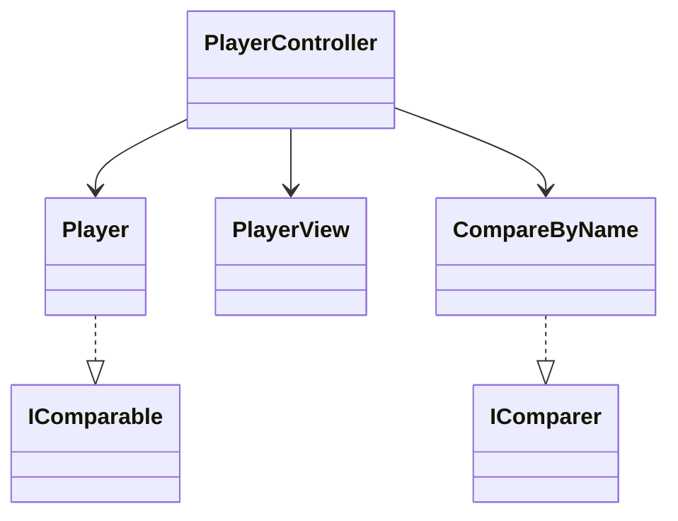

# PlayerManagerMVC

## UML Class Diagram

```mermaid
classDiagram
    class Player { 
    }
    class PlayerView {
    }

    class PlayerController {
    }

    class CompareByName {
    }

    PlayerController --> PlayerView
    PlayerController --> Player
    PlayerController --> CompareByName
    CompareByName ..|> IComparer
    Player ..|> IComparable

```